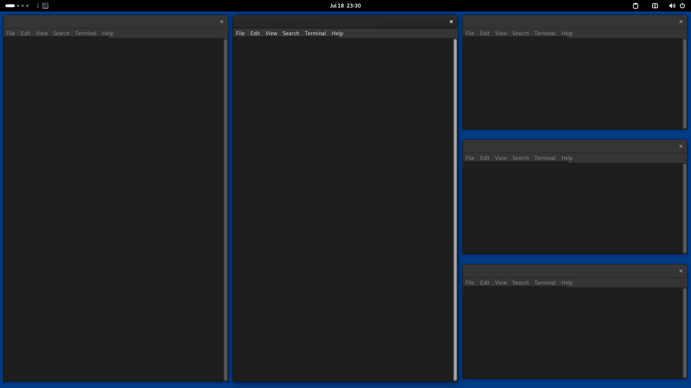

# gi3

A GNOME Shell extension that brings i3/sway-style tiling to GNOME — per-workspace tile
mode, splits, gaps, a scratchpad — plus a set of free-floating window tricks (directional
focus/move/swap/snap/resize), a clipboard history, and a per-workspace app tray.



## Features

- **i3/sway-style tiling, per workspace** — each workspace is tiled or free
  independently; toggle the current one with `Super+T` or by clicking the top-bar
  indicator. New windows tile automatically next to the focused one.
- **Splits and layouts** — horizontal/vertical splits (`Super+B` / `Super+V`), layout
  cycling, focus-parent/child to operate on whole containers, resizable panes (keybinds
  or just drag), floating toggle, fullscreen.
- **Gaps** — inner/outer gaps, adjustable live with keybinds. Changes made in preferences
  apply after the extension reloads.
- **Scratchpad** — global, i3-style: stash any number of windows (`Shift+Super+minus`)
  and summon them on any workspace, tiled or free. Each window returns at its last position
  and size, including the first summon after stashing (`Super+minus` toggles and cycles
  through them; `Ctrl+Super+minus` swaps straight to the next one). A stacked
  app-icon indicator appears at the right edge of the top bar's left section while windows
  are stashed — low opacity when they're all hidden, full when one is shown — and clicking
  it toggles the show.
- **i3/sway keybinding import/export** — import recognized `bindsym` shortcuts from an
  i3/sway config, or export current shortcuts, from the Keybinds preferences page. This
  does not import a complete desktop configuration or window rules.
- **Free-mode tricks** — directional focus, swap, nudge, snap-to-half, and grow/shrink
  for regular floating windows; optionally remember and restore each app's free-mode
  window geometry.
- **System monitor** — upload/download rates at the far-left of the top bar's right section,
  followed by CPU and memory usage, plus NVIDIA GPU usage when `nvidia-smi` is available.
  No extra dependencies (reads `/proc` directly).
- **Temperatures** — the hottest sensor in the top bar (tinted when it runs hot); click
  it for a scrollable, hottest-first list capped at half the available display height.
- **Clipboard history** — scrollable top-bar dropdown capped at half the available display
  height (`Shift+Super+V`).
- **App tray** — compact per-workspace app-icon stacks in the top bar keep every open
  app visible across workspace changes; click a group to jump to that workspace.

## Keybinds

Defaults, all rebindable in preferences (`Super` = the Windows/Meta key).

### Tiling mode

| Keys | Action |
| ---- | ------ |
| `Super+T` | Toggle tiling for the current workspace. |
| `Super+H/J/K/L` | Focus window left/down/up/right. |
| `Shift+Super+H/J/K/L` | Move window within the tree. |
| `Alt+Super+H/L`, `Alt+Super+K/J` | Shrink/grow the focused pane. |
| `Super+B` / `Super+V` | Split horizontal / vertical. |
| `Super+W` | Cycle the focused container's layout. |
| `Super+A` / `Shift+Super+A` | Focus parent / child container. |
| `Ctrl+Super+Space` | Toggle floating for the focused window. |
| `Super+F` | Toggle fullscreen. |
| `Ctrl+Super+PageDown/PageUp` | Move window to next/previous workspace. |
| `Shift+Super+[` / `Shift+Super+]` | Increase / decrease gaps. |
| `Shift+Super+minus` | Move window to the scratchpad. |
| `Super+minus` | Show/hide the scratchpad window (repeat to cycle through members). |
| `Ctrl+Super+minus` | Cycle directly to the next scratchpad window. |

### Free mode

| Keys | Action |
| ---- | ------ |
| `Super+H/J/K/L` | Focus the window left/down/up/right. |
| `Ctrl+Alt+Super+H/J/K/L` | Swap with the window left/down/up/right. |
| `Shift+Super+H/J/K/L` | Nudge the window left/down/up/right. |
| `Shift+Ctrl+Super+H/J/K/L` | Snap the window to the left/bottom/top/right half. |
| `Alt+Super+H/L`, `Alt+Super+K/J` | Shrink/grow the window. |
| `Ctrl+Super+W` | Center the focused window. |
| `Shift+Super+W` | Center all windows in the workspace. |
| `Ctrl+Alt+Super+W` | Center the workspace. |

### Always available

| Keys | Action |
| ---- | ------ |
| `Shift+Super+V` | Open the clipboard history. |

## Install

### GNOME Extensions

Install gi3 from its [GNOME Extensions listing](https://extensions.gnome.org/extension/10571/gi3/).

### From source

```sh
git clone https://github.com/voidverse-xyz/gi3
cd gi3
./install.sh
```

`install.sh` builds the release package and installs it with `gnome-extensions install`;
log out and back in, then enable with `gnome-extensions enable gi3@voidverse.xyz`.

### Packaging a zip

`./package.sh` creates the release archive `gi3.zip` from `src/`. It includes the
schema XML but excludes the generated `schemas/gschemas.compiled` file.

## Development

`npm test` runs the pure layout-engine, config-parser, geometry, and network test suite.
The experimental nested GNOME harness under `dev/` is documented in `dev/README.md`;
its installation flow currently expects a development packaging mode that is not part
of `package.sh`.

Project internals are documented in [docs/architecture.md](docs/architecture.md), with
additional tiling notes under [docs/tiling/](docs/tiling/).

## Acknowledgements

- [PaperWM](https://github.com/paperwm/PaperWM)
- [vKeyBind](https://github.com/00000vish/vKeyBind)
- [Tiling Shell](https://github.com/domferr/tilingshell)
- [GNOME Control Center](https://gitlab.gnome.org/GNOME/gnome-control-center)

See [THIRD_PARTY_NOTICES.md](THIRD_PARTY_NOTICES.md) for licensing details.
